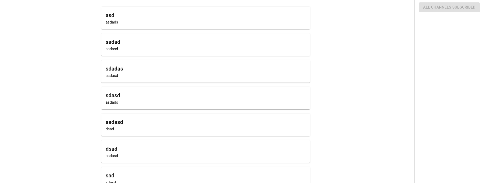
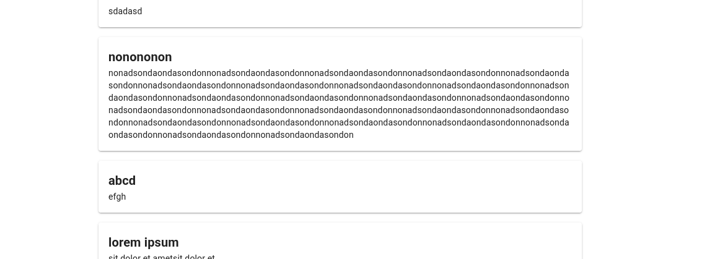
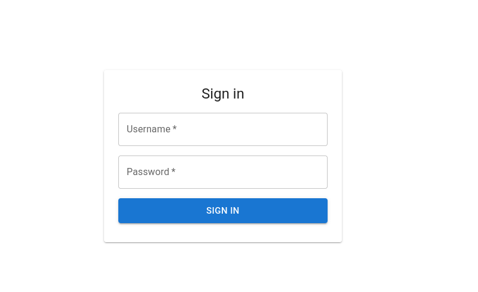
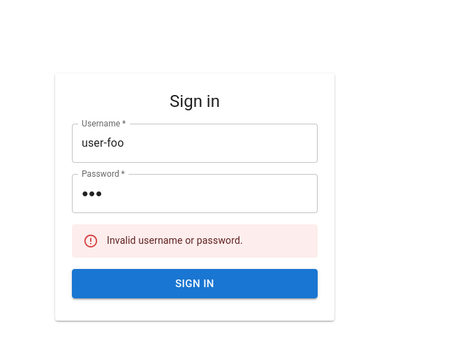
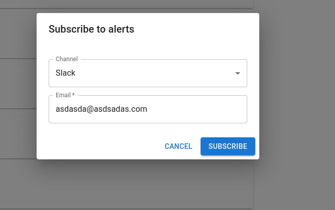
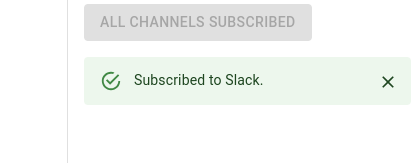
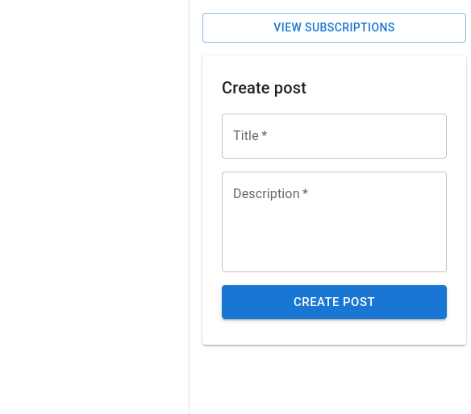
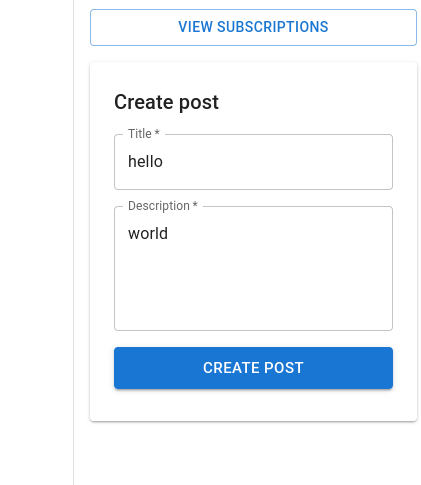
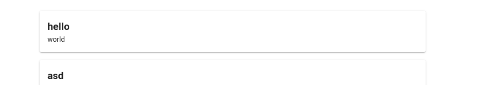
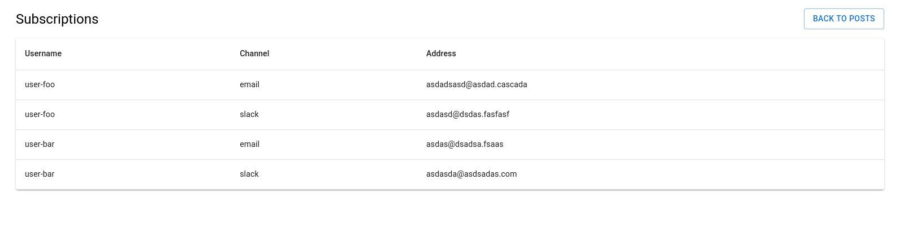

# Assignment

The following brief for a feature was to be interpreted, planned and implemented:

*"We want users to be able to set up alerts so they get notified when something important happens in the world — like breaking news, market movements, natural disasters, that kind of thing. Should work for both email and Slack. Make it flexible enough that we can add more channels later. We need an admin view too."*

Nothing else is given about the environment, application etc., these had to be arbitrarily set up by me. Plans were requested, they are available at `plan.txt`, this contains all of my initial plans and interpretations for this assignment.

For this purpose, I built a Next.js application. The plans were mostly written by me and checked by AI. Some small additions were made to the plans, suggested by the AI. Coding was mostly done by the AI, with me fixing a few odd React hooks; removing code not in scope; refactoring redundant codes.

AI prompts were requested. They are available as a `markdown` at `full-transcript.md`. The AI in use is Claude Code.

Images of the end result are available under `screenshots`. Also featured at the bottom of this README.

## Running

```
npm i
npm run dev
```

## Screenshots










